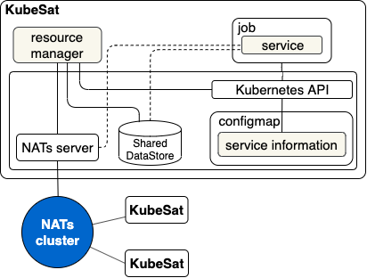

# KubeSat

KubeSat is an open-source project for building a cognitive, autonomous framework for satellite constellations and swarms. It provides the framework needed to develop and operate tasks to be performed on Satellite. Also, it allows for the simulation and optimization of multi-satellite communications.

## How It Works 

KubeSat provides a framework to manage services for devices.

### Architecture

### KubeSat environment

- __NATs server__ : NATs are messaging services that support a variety of network topologies. For KubeSat to communicate through NATs, a NATs cluster must be configured in advance. Refer to [NATs Cluster Configuration](https://docs.nats.io/nats-server/configuration/clustering) for NATs cluster configuration.
- __Kubernetes API__ : Kubernetes is a run-time environment to execute services. KubeSat uses Kubernetes API to manage Services in Kubernetes.

### KubeSat library

- __Resource Manager__: Resource Manager monitors jobs and system resources in the Kubernetes and performs a new task as Kubernetes Jobs upon request.
 - __Service__: A service runs as a Kubernetes Job. It can be a general container for Kubernetes or a container developed using the KubeSat library.
 - __Service Information__: Stores available service information that can be performed.

### KubeSat Simulation

KubeSat Simulation is developed using KubeSat library to simulate multi-satellite communications. It simulates accurate orbital mechanics for each object via OreKit; uses these calculations to place restrictions on communications between satellites, groundstation, and ground sensors; incorporates NATS.io messaging services; and publishes these communications for visualization on a web dashboard built using Cesium and Carbon. Refer to [KubeSat Simulation](/simulation/) to see the detail.

## Getting Started

To develop a new service, start with [getting-started](/docs/getting-started.md).

To deploy the simulation, try [simulation quick start](/docs/simulation-quick-start.md).

## License

KubeSat is licensed under the Apache 2.0 license. Full license text is available at [LICENSE](LICENSE).
